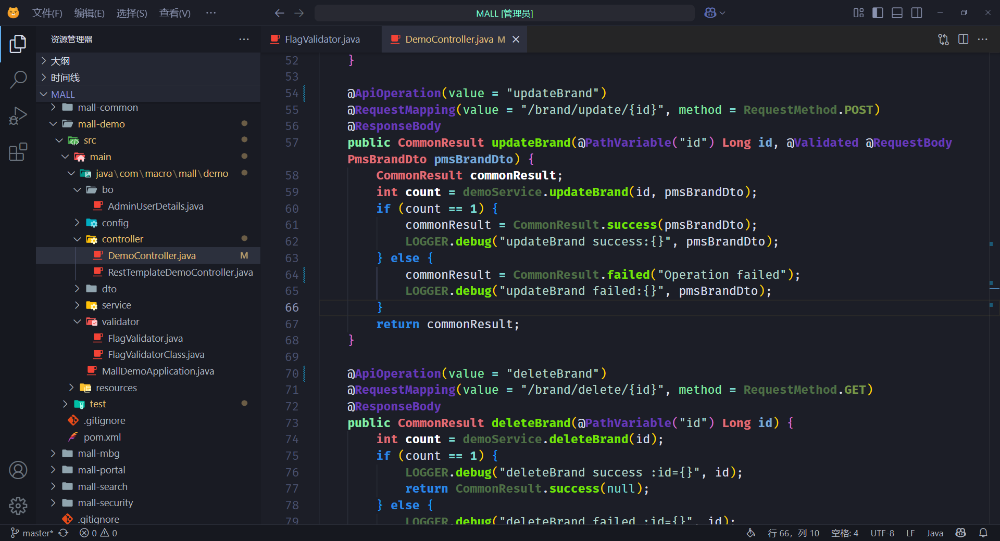

# Hologram Night for VSCode

## 纯粹青蓝在深暗中闪耀 ✨，一个清冷、专注的赛博朋克编码环境

这个主题是为追求极致专注和独特视觉风格的开发者而设计的。灵感来源于经典的赛博朋克美学和数字世界的冷峻感，我们将色彩简化到极致，以纯粹的青蓝色作为核心光芒，在深邃的暗夜背景中为您构建一个沉浸式的编码空间。

## Screenshot

### 主题特色

- **聚焦的青蓝主色调**: 界面元素、语法高亮和关键信息都以精心挑选的青蓝色呈现，避免了色彩干扰，帮助您将注意力完全集中在代码本身。
- **深邃的暗夜背景**: 提供一个低对比度、不刺眼的背景，减少眼部疲劳，长时间编码依然舒适。
- **清冷且专注的氛围**: 整体配色方案营造出一种冷静、高效的工作氛围，仿佛置身于数字矩阵的核心。
- **精简的视觉设计**: UI 元素设计简洁，去除冗余装饰，让您的 VS Code 界面保持干净利落。

### 安装

1. 打开 VS Code。
2. 进入 Extensions (扩展) 视图（侧边栏中的方块图标）。
3. 搜索 "**Hologram Night**" (或者你最终确定的主题名称)。
4. 点击 **Install** (安装)。
5. 安装完成后，点击 **Set Color Theme** (设置颜色主题)，然后选择 "**Hologram Night**"。

或者：

通过 VS Code 命令面板 (`Ctrl+Shift+P` 或 `Cmd+Shift+P`) 输入 `Install Extension`，然后搜索并安装。

### 贡献

如果你有任何关于这个主题的建议或者发现了问题，欢迎通过以下方式贡献：

- 在 [vscode-theme-hologram-night](https://github.com/OrcheInk/vscode-theme-hologram-night) 提交 Issue 报告问题或提出建议。
- 如果需要修改，欢迎提交 Pull Request。

### 许可证

[MIT License](https://github.com/OrcheInk/vscode-theme-hologram-night/blob/main/LICENSE)

---

**享受纯粹青蓝带来的专注编码体验吧！**
